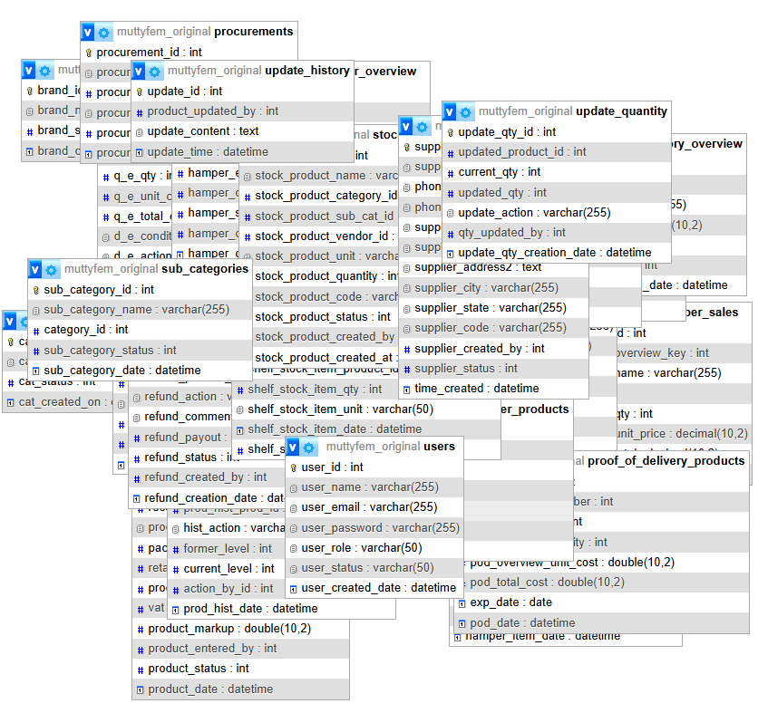

# Muttyfem Supermarket Admin Panel

A full-featured, production-used PHP admin panel built to manage the day-to-day operations of a supermarket — from point of sale and inventory to procurement, reporting, and barcode labeling.

---

## Tech Stack

**Libraries:** DOMPDF · FPDF · TCPDF · DataTables · SweetAlert2 · Font Awesome · Google Charts

---

## The Problem It Solves

Managing a supermarket manually — tracking stock, processing sales, generating purchase orders, and producing reports — is time-consuming and error-prone. This system centralises all of that into one platform, giving different staff members access to only what they need, while giving management full visibility over the business.

---

## Modules & Features

### Point of Sale (POS)
- Real-time product lookup by name or barcode
- Dynamic cart with quantity and total calculations
- Cash and card payment handling with change calculation
- Auto-generated invoice numbers
- Instant receipt generation (PDF, print-ready)
- Separate POS interface for hamper/gift sales

### Inventory Management
- Full product catalog with categories, sub-categories, and brands
- Multi-level stock tracking (warehouse → shelf)
- Manual quantity adjustment with update history log
- Expiry and damage reporting with action logging (destroy / return)
- Low stock alerts and printable low stock reports

### Procurement & Suppliers
- Supplier database management
- Purchase order creation with auto-generated PO numbers
- Proof of Delivery (POD) tracking
- Outstanding payment calculations per delivery
- Printable purchase orders and delivery notes (PDF)

### Hamper Management
- Create and customise gift hampers from existing products
- Hamper-specific POS and invoicing
- Batch barcode generation for hamper labeling
- Hamper sales history per cashier

### Reporting & Analytics
| Report | Description |
|---|---|
| Daily Sales | Product-level sales breakdown for any given day |
| Periodic Sales | Sales analysis between two custom dates |
| Monthly Sales | Month-specific revenue and quantity breakdown |
| Yearly Sales | Year-over-year sales overview |
| Cashier Daily Report | Per-cashier transaction reconciliation |
| Expiry / Damage Report | Inventory written off by expiry or damage |
| Low Stock Report | Products falling below stock thresholds |

All reports export to **PDF**.

### Barcode & Label Printing
- CODE128 barcode generation for individual products
- Batch price sticker printing for shelf labeling
- Hamper barcode batch generation
- Custom sticker layout with product name, price, and barcode

### User & Access Management
- Four role levels with different permissions:
  - **Super Admin** — full system access
  - **Admin** — procurement and delivery
  - **Sub Admin** — delivery only
  - **Cashier** — POS, hamper sales, and transaction history
- Session-based authentication
- Account enable/disable controls

### Dashboard
- Live counters: total products, suppliers, categories
- Today's sales, monthly sales, total revenue
- Outstanding delivery payments
- Recent transactions and purchase orders feed
- Auto-refreshes every 10 minutes

---

## Database

**24 relational tables** covering:
- Products, categories, sub-categories, brands, suppliers
- POS transactions and line items
- Purchase orders and proof of delivery
- Hamper definitions, sales, and items
- Stock levels, shelf management, refunds, expiry logs
- User accounts and audit history

All queries use **PDO prepared statements** throughout.

### Database Schema (ERD)

---

## Architecture

- **OOP PHP** — `DB` → `Query` → `Loader` class inheritance for database access
- **AJAX-driven UI** — all CRUD operations are asynchronous (no full page reloads)
- **Role-based routing** — server-side session checks on every page
- **Separated concerns** — view pages at root, logic handlers in `/actions/`, reusable partials in `/partials/`
- **Multi-library PDF engine** — DOMPDF for HTML-to-PDF receipts, FPDF for structured reports, TCPDF for barcode stickers
- **Dark / Light theme** — user preference persisted via cookie

---

## Role Access Summary

| Feature | Super Admin | Admin | Sub Admin | Cashier |
|---|:---:|:---:|:---:|:---:|
| Dashboard | ✅ | ❌ | ❌ | ❌ |
| Products / Inventory | ✅ | ❌ | ❌ | ❌ |
| Procurement | ✅ | ✅ | ❌ | ❌ |
| Delivery (POD) | ✅ | ✅ | ✅ | ❌ |
| POS | ❌ | ❌ | ❌ | ✅ |
| Hamper Sales | ❌ | ❌ | ❌ | ✅ |
| Reports | ✅ | ❌ | ❌ | ❌ |
| User Management | ✅ | ❌ | ❌ | ❌ |

---

*Built with PHP, MySQL, Bootstrap 5, jQuery, and multiple PDF generation libraries.*
